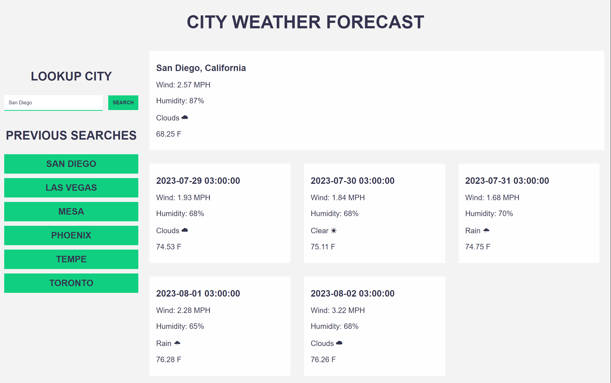

# Challenge 06 - City Weather Forecast

## Description

Visiting this web application allows users to search for a city in the world and pull up its current weather data and the weather forecast for the 5 following days. With this information, the user can make and adjust their plans according to the results. It should be noted the times may be off compared to the local time of the user and the time of the searched location due to the API using Coordinated Universal Time(UTC).

## Installation

There is no Installation involved on the users side to utilize this webpage; just visit [https://hello-andyjoe.github.io/Challenge-6-Weather-Forecast/](https://hello-andyjoe.github.io/Challenge-6-Weather-Forecast/)

## Usage

To use, visit the web page and think of a city you would like to know the weather forecast. Type the name of that city in the input box on the upper, left side of the screen under the header "LOOKUP CITY" and click the "SEARCH" button. This will show the first city fetched from the API with the current weather condition with the 5 day forecast shown underneather. The city you had just searched will show up as a button underneath PREVIOUS SEARCHES header on the left side of the screen. This will save upto your six searches with any additional searches knocking the oldest one from the bottom of the list. Clicking one of these buttons will rerun the application to search for the city that you click the respective button.

## Credits

OpenWeather API was used and the documentation was referred to in the creation of the app. - [https://openweathermap.org/](https://openweathermap.org/)

Previously assignment of the Javascript Quiz and Module 4 Activity #26 were used as reference in regards to looping Local Storage.

## License

MIT License

Copyright (c) 2023 Hello-AndyJoe

Permission is hereby granted, free of charge, to any person obtaining a copy
of this software and associated documentation files (the "Software"), to deal
in the Software without restriction, including without limitation the rights
to use, copy, modify, merge, publish, distribute, sublicense, and/or sell
copies of the Software, and to permit persons to whom the Software is
furnished to do so, subject to the following conditions:

The above copyright notice and this permission notice shall be included in all
copies or substantial portions of the Software.

THE SOFTWARE IS PROVIDED "AS IS", WITHOUT WARRANTY OF ANY KIND, EXPRESS OR
IMPLIED, INCLUDING BUT NOT LIMITED TO THE WARRANTIES OF MERCHANTABILITY,
FITNESS FOR A PARTICULAR PURPOSE AND NONINFRINGEMENT. IN NO EVENT SHALL THE
AUTHORS OR COPYRIGHT HOLDERS BE LIABLE FOR ANY CLAIM, DAMAGES OR OTHER
LIABILITY, WHETHER IN AN ACTION OF CONTRACT, TORT OR OTHERWISE, ARISING FROM,
OUT OF OR IN CONNECTION WITH THE SOFTWARE OR THE USE OR OTHER DEALINGS IN THE
SOFTWARE.